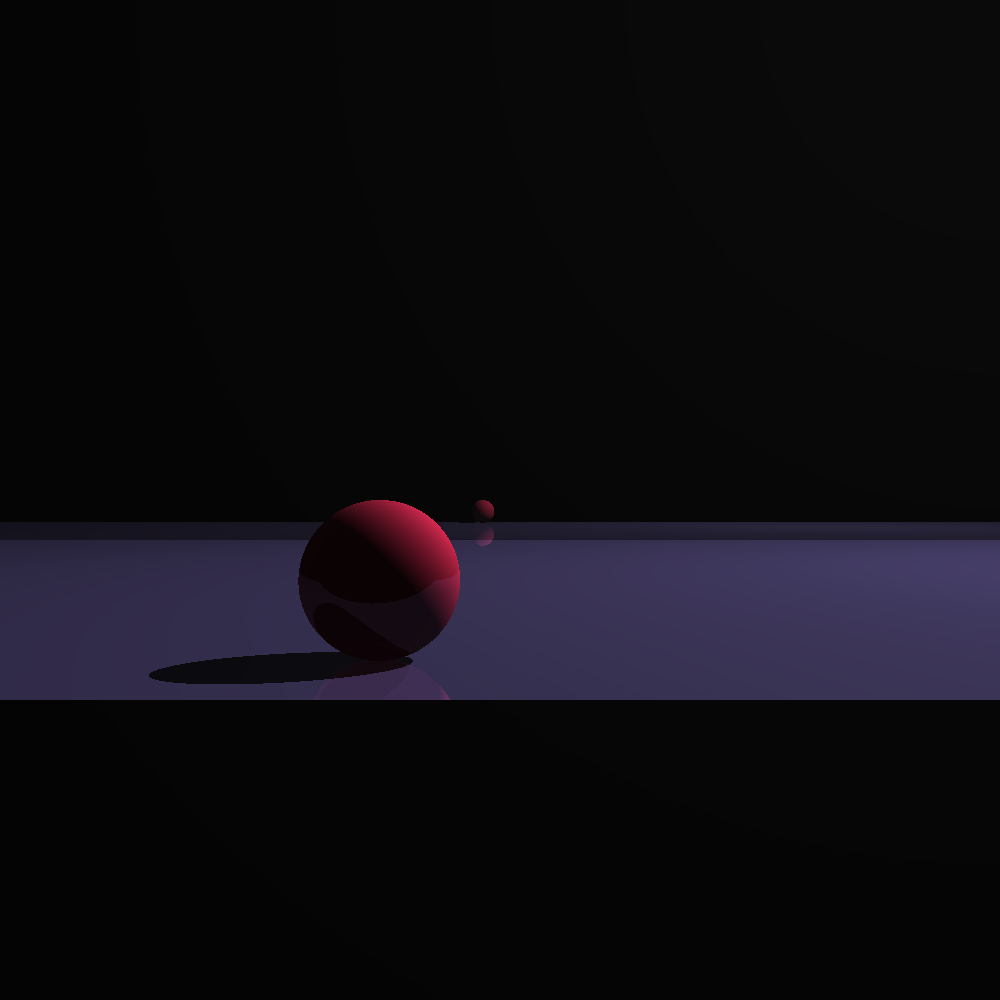

# phong_rust

this is a very unoptimised version of a [phong renderer](https://en.wikipedia.org/wiki/Phong_shading) written in rust.

Currently only supports spheres and planes untill i can find the equatoin for the surface normal of a torus. I will then add toruses. Contributions are very welcome (:

Results:

